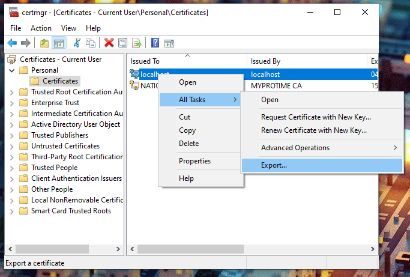

# GrpcTests

## R Resources

https://github.com/eddelbuettel/rprotobuf

https://github.com/nfultz/grpc

## Python

Install GRPC 

`python -m pip install grpcio`

Install GRPC tools

`python -m pip install grpcio-tools`

Generate python code from proto file

`python -m grpc_tools.protoc -I../GrpcShared --python_out=. --pyi_out=. --grpc_python_out=. ../GrpcShared/poc.proto`

### Certificate

Development certificate used by C# need to be exported. It can be done by launching **certmgr**.

In the Personnal folder, you should find a localhost entry. It can be exported through *All Tasks* > *Export*



Don't export the private key and choose the base-64 format.

> This file need to be read by Python script to call https entry point. Name it `dev.cer` and copy it in the script directory or modify the code accordingly.


## Troubleshoot

If GRPC throws an exception related to SSL while testing locally, please try to [reset the development certificates](https://docs.microsoft.com/en-us/aspnet/core/security/enforcing-ssl?view=aspnetcore-5.0&tabs=visual-studio#trust-the-aspnet-core-https-development-certificate-on-windows-and-macos).

```powershell
dotnet dev-certs https --clean
dotnet dev-certs https --trust
```
